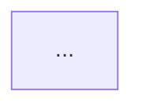

# Plan 13-06: Export, HLD, Polish

## Goal
Build the Design Document tab with AI-generated HLD and Mermaid diagrams, implement documentation export in Markdown/PDF/Plain Text formats with section selection, add animations and visual polish throughout the plugin, and handle error/edge cases.

## Requirements Covered
CBAN-09, CBAN-10, CBAN-14

## Dependencies
Plan 13-01 (types, store, IPC bridge).
Plan 13-02 (analysis engine — entities, routes, components for HLD generation).
Plan 13-03 (InsightsPanel with Design sub-tab placeholder, export button).
Plan 13-04 (FlowDiagram — for understanding the flow visualization patterns).
Plan 13-05 (QAPanel — for AI streaming pattern reuse).

## New Dependencies
None — mermaid (^11.12) and pdfmake (^0.3.5) are already installed.

## Files to Create
- `src/renderer/src/plugins/codebase-analyzer/components/DesignDocTab.tsx`
- `src/renderer/src/plugins/codebase-analyzer/components/ExportDialog.tsx`
- `src/main/codebase-analyzer/doc-generator.ts`
- `src/main/codebase-analyzer/mermaid-generator.ts`

## Files to Modify
- `src/renderer/src/plugins/codebase-analyzer/components/InsightsPanel.tsx` (replace Design placeholder, add Export button handler)
- `src/renderer/src/plugins/codebase-analyzer/components/OverviewTab.tsx` (add "Generate Documentation" AI button)
- `src/main/ipc-handlers.ts` (add export and doc generation IPC handlers)
- `src/preload/index.ts` (add export and doc generation bridge methods)
- `src/renderer/src/types/electron.d.ts` (add new method types)

## Tasks

### Task 1: Design Document Tab with Mermaid Diagrams and Doc Generation

**Files:** `DesignDocTab.tsx`, `doc-generator.ts`, `mermaid-generator.ts`, `InsightsPanel.tsx` (modify), `OverviewTab.tsx` (modify)

**mermaid-generator.ts** (main process) — Generate Mermaid diagram syntax from analysis results:

```typescript
import type { AnalysisResult, CodeEntity, CallEdge, RouteInfo, ComponentInfo, PipelineInfo } from '../types'

export function generateArchitectureDiagram(result: AnalysisResult): string { ... }
export function generateAPIFlowDiagram(result: AnalysisResult): string { ... }
export function generateComponentTreeDiagram(result: AnalysisResult): string { ... }
export function generatePipelineDiagram(result: AnalysisResult): string { ... }
export function generateClassDiagram(result: AnalysisResult): string { ... }
```

Implementation details:

1. **`generateArchitectureDiagram`** — High-level system architecture:
   ```
   flowchart TB
     subgraph Presentation["Presentation Layer"]
       Controller1["UserController"]
       Controller2["OrderController"]
     end
     subgraph Business["Business Layer"]
       Service1["UserService"]
       Service2["OrderService"]
     end
     subgraph Data["Data Access Layer"]
       Repo1["UserRepository"]
       Repo2["OrderRepository"]
     end
     subgraph Storage["Storage"]
       DB[("Database")]
     end
     Presentation --> Business --> Data --> Storage
   ```
   Group entities by kind (controller/service/repository) into subgraphs. Connect layers.

2. **`generateAPIFlowDiagram`** — Per-endpoint flow:
   ```
   sequenceDiagram
     participant Client
     participant Controller
     participant Service
     participant Repository
     participant DB
     Client->>Controller: POST /api/users
     Controller->>Service: createUser(data)
     Service->>Repository: save(user)
     Repository->>DB: INSERT
   ```

3. **`generateComponentTreeDiagram`** (FE repos):
   ```
   flowchart TD
     App --> Layout
     Layout --> Sidebar
     Layout --> MainContent
     MainContent --> Dashboard
     MainContent --> Settings
   ```

4. **`generatePipelineDiagram`** (DE repos):
   ```
   flowchart LR
     trigger["Trigger: Cron"]
     task1["Extract Data"]
     task2["Transform"]
     task3["Load to DW"]
     trigger --> task1 --> task2 --> task3
   ```

CRITICAL: Sanitize all labels using a `sanitizeMermaidLabel` function:
- Replace `<` with `[`, `>` with `]` (generics break Mermaid)
- Replace `"` with `'`
- Replace `|` with ` - `
- Wrap labels in double quotes: `nodeId["label text"]`
- Limit label length to 40 chars, truncate with `...`

5. **`generateClassDiagram`** — Show class relationships:
   ```
   classDiagram
     class UserController {
       +getUsers() List~User~
       +createUser(data) User
     }
     class UserService {
       +findAll() List~User~
       +create(data) User
     }
     UserController --> UserService
   ```

**doc-generator.ts** (main process) — Generate the HLD document text:

```typescript
export function generateHLDDocument(result: AnalysisResult, mermaidDiagrams: Record<string, string>): string { ... }
```

Generates a markdown document with sections:
1. **Project Overview** — repo type, framework, language, file count, line count
2. **Architecture Overview** — embedded Mermaid architecture diagram
3. **API Endpoints** (BE repos) — table of all routes with method, path, handler
4. **Component Structure** (FE repos) — component tree diagram + props summary
5. **Data Pipelines** (DE repos) — pipeline flow diagram + schedule info
6. **Key Modules** — top 10 most-connected entities with their descriptions
7. **Dependencies** — entity kind breakdown, call graph statistics
8. **Class Diagrams** — embedded Mermaid class diagram for top classes

Each Mermaid diagram is embedded as:
```markdown

```

**DesignDocTab.tsx** — Renders the generated HLD with Mermaid:

```typescript
import { useState, useEffect } from 'react'
import { motion } from 'framer-motion'
import { BookOpen, RefreshCw, Loader2 } from 'lucide-react'
import { useCodebaseAnalyzerStore } from '../../../../stores/codebase-analyzer-store'
```

Layout:
- Header: "High Level Design" title + "Generate" / "Regenerate" button
- Content: scrollable rendered markdown with Mermaid diagrams
- If no HLD exists: "Generate Design Document" button centered with description

Generation flow:
1. Click "Generate" button
2. Show loading state (Loader2 spinning, skeleton placeholders)
3. Call IPC handler to generate the HLD (new handler: `cban:generateHLD`)
4. The main process uses `mermaid-generator.ts` to create diagrams and `doc-generator.ts` to assemble the markdown
5. Return the full markdown string
6. Store in `analysisResult.documentation` (or a separate `designDoc` field in the store)
7. Render the markdown using either:
   - The existing `MarkdownRenderer` component (search for it in the codebase — it should handle mermaid code blocks already since MermaidRenderer exists)
   - A custom renderer that splits content by `\`\`\`mermaid` blocks, renders text sections as HTML, and renders mermaid blocks using the existing Mermaid integration

For Mermaid rendering, check if the project has a `MermaidRenderer` component. If so, use it directly. The Mermaid library is already installed at v11 and should render diagrams inline.

If a full AI-powered HLD is desired (richer than template-based), use the AI streaming pattern from QAPanel:
- System prompt: Include all analysis metadata (entities, routes, stats)
- User prompt: "Generate a comprehensive High Level Design document for this codebase. Include architecture overview, module descriptions, data flow, and key design decisions. Use Mermaid diagrams for visual representations."
- Stream the response and render progressively

**Modify OverviewTab.tsx** — Add "Generate Documentation" button:
- If `analysisResult.documentation` is empty, show a prominent button: "Generate AI Documentation"
- On click: use `ai:startAnalysis` to generate an overview document
- Stream response into `analysisResult.documentation`
- System prompt includes all entity, route, and stats information
- User prompt: "Generate a concise project documentation overview covering architecture, key modules, API surface, and technology stack."

**Modify InsightsPanel.tsx**:
- Replace `{insightsSubTab === 'design' && <div>...</div>}` with `{insightsSubTab === 'design' && <DesignDocTab />}`
- Import DesignDocTab

**Add IPC handlers** in `src/main/ipc-handlers.ts`:

```typescript
ipcMain.handle('cban:generateHLD', async (_event, repoUrl: string, branch: string) => {
  const { analyzer } = getCbanInstances()
  const analysis = analyzer.cache.getAnalysis(repoUrl, branch, '')  // latest
  if (!analysis) throw new Error('No analysis found. Analyze the repository first.')
  const diagrams = {
    architecture: generateArchitectureDiagram(analysis),
    apiFlow: generateAPIFlowDiagram(analysis),
    componentTree: generateComponentTreeDiagram(analysis),
    pipeline: generatePipelineDiagram(analysis),
    classDiagram: generateClassDiagram(analysis),
  }
  return generateHLDDocument(analysis, diagrams)
})

// Export uses existing app:saveTextFile and app:exportPdf handlers — no additional IPC handler needed
```

**Add preload bridge** for `cban:generateHLD`:
```typescript
generateHLD: (repoUrl: string, branch: string): Promise<string> =>
  ipcRenderer.invoke('cban:generateHLD', repoUrl, branch),
```

**Add electron.d.ts type**:
```typescript
generateHLD: (repoUrl: string, branch: string) => Promise<string>
```

### Task 2: Export Dialog, PDF/MD/TXT Export, and Visual Polish

**Files:** `ExportDialog.tsx`, `ipc-handlers.ts` (modify), `preload/index.ts` (modify), `electron.d.ts` (modify)

**ExportDialog.tsx** — Modal dialog for exporting documentation:

```typescript
import { useState } from 'react'
import { motion, AnimatePresence } from 'framer-motion'
import { FileText, FileDown, AlignLeft, X, Download } from 'lucide-react'
import { useCodebaseAnalyzerStore } from '../../../../stores/codebase-analyzer-store'
```

Modal overlay: `className="fixed inset-0 z-50 flex items-center justify-center bg-background/80 backdrop-blur-sm"`

Modal content: `className="w-[480px] rounded-xl border border-border bg-surface p-6 shadow-2xl"`

Entrance: `motion.div` with `initial={{ scale: 0.95, opacity: 0 }}`, `animate={{ scale: 1, opacity: 1 }}`

Sections:
1. **Format selector** — Three format buttons in a row:
   - Markdown (FileText icon)
   - PDF (FileDown icon)
   - Plain Text (AlignLeft icon)
   - Active: `border-accent/40 bg-accent/10 text-accent`
   - Inactive: `border-border text-text-secondary hover:border-accent/20`

2. **Section checkboxes** — Select which sections to export:
   - Project Overview
   - Architecture Diagram
   - API Endpoints
   - Component Structure (FE only)
   - Data Pipelines (DE only)
   - Class Diagrams
   - Key Modules
   - Full HLD Document

   Default: all selected. Individual toggles.
   Styling: `className="flex items-center gap-2 text-sm text-text-primary"` with accent-colored checkboxes

3. **Include diagrams toggle** — For PDF export: "Render Mermaid diagrams as images" checkbox

4. **Action buttons** — Cancel (ghost) + "Export" (primary accent button)

Export logic by format:

**Markdown:** Assemble selected sections into a single markdown string. Use the existing `app:saveTextFile` IPC handler:
```typescript
const result = await window.api.app.saveTextFile(
  markdownContent,
  `${repoName}-documentation.md`,
  [{ name: 'Markdown', extensions: ['md'] }]
)
```

**Plain Text:** Strip markdown syntax from the assembled content (remove `#`, `**`, `` ` ``, code fences, mermaid blocks). Use the same `app:saveTextFile`:
```typescript
const result = await window.api.app.saveTextFile(
  plainTextContent,
  `${repoName}-documentation.txt`,
  [{ name: 'Text', extensions: ['txt'] }]
)
```

**PDF:** Use the existing `app:exportPdf` IPC handler which already handles markdown-to-PDF via pdfmake:
```typescript
const result = await window.api.app.exportPdf({
  markdown: markdownContent,
  title: `${repoName} - Documentation`,
  mermaidImages: mermaidRenderedImages,  // Record<number, base64DataUrl>
  orientation: 'portrait'
})
```

For Mermaid images in PDF: Before exporting, render each mermaid diagram to SVG using `mermaid.render()`, convert SVG to base64 data URL, pass as `mermaidImages` record keyed by diagram index. The existing PDF export infrastructure already supports this pattern (check how other plugins handle mermaid in PDF).

Wire the Export button in InsightsPanel.tsx:
- Add Export button (Download icon) in the InsightsPanel header area
- On click: show `<ExportDialog />`
- Pass close handler to dismiss the dialog

**Visual polish across all components:**

Add/verify these animation and polish details:

1. **Tab transitions** — Already in CodebaseAnalyzerView.tsx via AnimatePresence. Verify they work smoothly.

2. **Card entrance animations** — OverviewTab stat cards should use staggered fade-in:
   ```typescript
   <motion.div
     initial={{ opacity: 0, y: 12 }}
     animate={{ opacity: 1, y: 0 }}
     transition={{ delay: index * 0.08, duration: 0.3 }}
   />
   ```

3. **Skeleton loading states** — Add skeleton components for:
   - InsightsPanel while analysis result is loading: 6 skeleton cards in a grid
   - DesignDocTab while HLD is generating: skeleton text blocks
   - CodeViewer while file content is loading: skeleton code lines

   Skeleton styling: `className="animate-pulse rounded bg-surface"` — use varying widths for text lines to look realistic.

4. **Hover effects on interactive elements:**
   - Repo cards: `hover-lift` class (already in Zenith CSS) for subtle elevation
   - API list rows: highlight row on hover
   - File tree items: background change on hover
   - Flow nodes: scale + glow (already in Plan 04)

5. **Status bar** at the bottom of CodebaseAnalyzerView (optional but impressive):
   - Left: repo name + branch + commit SHA (truncated)
   - Center: detected repo type badge with colored dot
   - Right: file count + entity count + "Last analyzed: X ago"
   - Styling: `className="flex items-center justify-between border-t border-border bg-surface px-4 py-1 text-[10px] text-text-secondary"`

6. **Error handling:**
   - Clone failures: show error message on repo card with retry button
   - Analysis failures: show error state with "Retry Analysis" button
   - AI Q&A failures: show error message in chat, allow retry
   - Network errors: show toast notification (if the app has a toast system)
   - Empty states: meaningful messages with action suggestions for every empty view

7. **Transition polish:**
   - When auto-switching from Repos → Insights after analysis, add a brief delay (300ms) so the transition feels intentional
   - When opening a file from a flow node click, the Code tab should scroll to and highlight the relevant line (if CodeMirror supports `scrollIntoView`)

## Verification

1. **HLD Generation:** Click "Generate" on the Design tab. Document appears with sections and Mermaid diagrams rendered inline. Architecture diagram shows layers. API flow shows sequence. Class diagram shows relationships.
2. **Mermaid renders correctly:** No "Diagram render error" messages. Special characters in labels are properly escaped.
3. **Export Markdown:** Click Export → select Markdown → choose sections → "Export" → file save dialog → .md file saved with correct content.
4. **Export PDF:** Click Export → select PDF → "Export" → file save dialog → .pdf file saved. Open PDF — content is formatted correctly with headers, code blocks, and optionally embedded diagram images.
5. **Export Plain Text:** Click Export → select Plain Text → "Export" → .txt file saved. No markdown syntax in output.
6. **Skeleton loaders:** All loading states show skeleton placeholders instead of empty screens.
7. **Error handling:** Force an error (e.g., invalid git URL) — appropriate error message appears, no unhandled exceptions.
8. **Animation quality:** Tab transitions are smooth (no flicker). Card entrances are staggered. Hover effects are responsive.
9. **Status bar:** Shows correct repo info, entity counts, last analyzed time.
10. **TypeScript:** `npx tsc --noEmit` passes
11. **Full flow test:** Add repo → clone → analyze → view insights → browse flows → open code files → ask Q&A question → export docs. All features work end-to-end.
